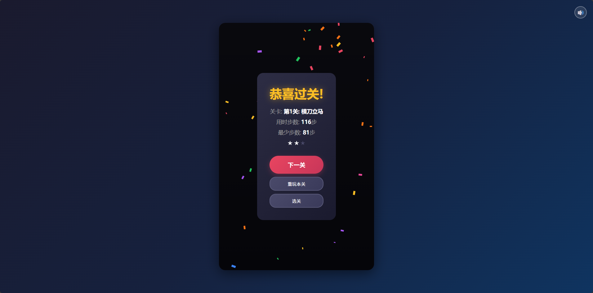
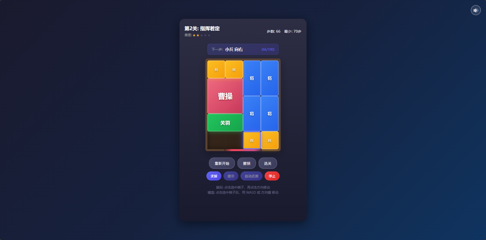

# 华容道 H5 游戏

一个完整的华容道益智游戏，支持15个关卡、选关、撤销、键盘鼠标双控制、解法提示和自动还原。

## 基本信息

- **作者**: authorZhao
- **创作时间**: 2026年2月
- **许可证**: MIT License

## 特别说明

本代码主要由 AI 创作。

感叹 AI 之强大，短短时间内便完成了完整的游戏实现，包括：
- 15个经典关卡配置
- 完整的游戏逻辑
- 解法求解算法 (BFS)
- 自动还原功能
- 精美的 UI 界面

特此开源，供大家学习交流。

## 快速开始

直接用浏览器打开 `index.html` 即可开始游戏。

## 功能特性

- 15个经典关卡
- 选关系统
- 鼠标和键盘双控制
- 撤销功能
- 过关特效
- 进度保存
- 移动端适配
- **解法提示** - 点击"求解"后可查看下一步提示
- **自动还原** - 自动完成整个解法

## 操作方式

### 鼠标控制
1. 点击选中棋子（会高亮显示）
2. 点击空位方向移动棋子

### 键盘控制
- `W` / `↑` - 向上移动
- `S` / `↓` - 向下移动
- `A` / `←` - 向左移动
- `D` / `→` - 向右移动
- `Z` + `Ctrl` - 撤销
- `R` - 重新开始
- `ESC` - 取消选择

### 解法功能
1. 点击 **求解** 按钮，系统会计算最优解
2. 点击 **提示** 按钮查看下一步，要移动的棋子会被高亮
3. 点击 **自动还原** 按钮，系统自动执行所有步骤
4. 点击 **停止** 按钮可以暂停自动还原

## 棋子说明

| 角色 | 尺寸 | 颜色 | 说明 |
|------|------|------|------|
| 曹操 | 2×2 | 红色 | 需要移到底部出口 |
| 关羽 | 2×1 | 绿色 | 横向大将 |
| 武将 | 1×2 | 蓝色 | 纵向武将 |
| 小兵 | 1×1 | 黄色 | 士兵 |

## 添加图片资源

游戏默认使用彩色方块表示棋子，你可以添加自定义图片：

```javascript
// 在游戏加载后调用
KlotskiGame.setPieceImage('cao', 'assets/images/cao.png');
KlotskiGame.setPieceImage('guan', 'assets/images/guan.png');
KlotskiGame.setPieceImage('jiang', 'assets/images/jiang.png');
KlotskiGame.setPieceImage('bing', 'assets/images/bing.png');
```

图片建议尺寸：
- 曹操: 140×140 像素
- 关羽: 140×70 像素
- 武将: 70×140 像素
- 小兵: 70×70 像素

## 添加音频资源

```javascript
KlotskiGame.setSound('bgm', 'assets/audio/bgm.mp3');     // 背景音乐
KlotskiGame.setSound('move', 'assets/audio/move.mp3');   // 移动音效
KlotskiGame.setSound('select', 'assets/audio/select.mp3'); // 选择音效
KlotskiGame.setSound('win', 'assets/audio/win.mp3');     // 胜利音效
KlotskiGame.setSound('click', 'assets/audio/click.mp3'); // 点击音效
```

## 文件结构

```
klotski/
├── index.html          # 主页面
├── css/
│   └── style.css       # 样式文件
├── js/
│   ├── levels.js       # 关卡数据
│   ├── piece.js        # 棋子类
│   ├── audio.js        # 音频管理
│   ├── effects.js      # 特效系统
│   ├── board.js        # 棋盘管理
│   ├── input.js        # 输入控制
│   ├── game.js         # 游戏逻辑
│   ├── ui.js           # UI管理
│   └── main.js         # 入口文件
└── assets/
    ├── images/         # 图片资源目录
    └── audio/          # 音频资源目录
```

## API 接口

```javascript
// 开始指定关卡
KlotskiGame.startLevel(1);

// 播放/暂停背景音乐
KlotskiGame.playBGM();
KlotskiGame.pauseBGM();

// 切换静音
KlotskiGame.toggleMute();

// 重置所有进度
KlotskiGame.resetProgress();

// 获取当前状态
KlotskiGame.getState();
```

## 关卡列表

1. 横刀立马 (81步)
2. 指挥若定 (70步)
3. 将拥曹营 (72步)
4. 齐头并进 (60步)
5. 兵分三路 (68步)
6. 层层设防 (65步)
7. 水泄不通 (80步)
8. 插翅难飞 (75步)
9. 左右布兵 (62步)
10. 前挡后阻 (70步)
11. 兵临城下 (58步)
12. 遥相呼应 (72步)
13. 峰回路转 (85步)
14. 纵横交错 (78步)
15. 四面楚歌 (100步)

## 运行效果展示





## 浏览器兼容性

- Chrome 60+
- Firefox 60+
- Safari 12+
- Edge 79+

## 许可证

MIT License
